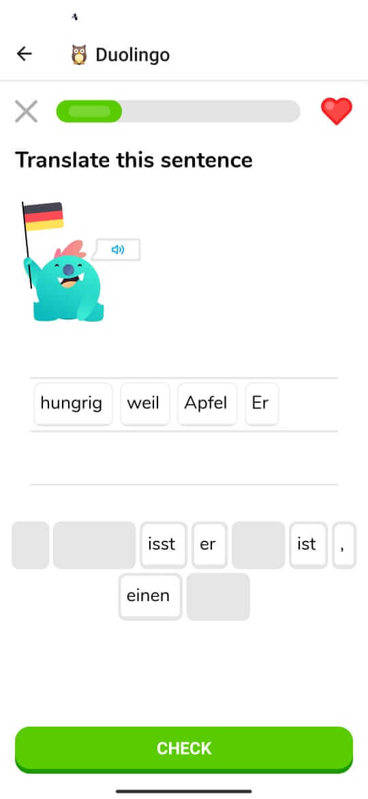

<p align="center">
   
</p>
 
<h1 align="center">Duolingo Drag-And-Drop</h1>

<p align="center">	
   <a href="https://www.linkedin.com/in/rafael-goulartb/">
      
   </a>
  

  
  <a href="https://github.com/RafaelGoulartB/duolingo-drag-and-drop#readme">
    
  </a>
   <a href="https://github.com/RafaelGoulartB/duolingo-drag-and-drop/commits/master">
      
  </a> 
  
   <a href="https://github.com/RafaelGoulartB/duolingo-drag-and-drop/stargazers">
      
   </a>
</p>

> Duolingo Drag-and-drop feature made with React Native. Made using this [video](https://www.youtube.com/watch?v=tHWGKdpj1rs).

<div align="center">
  <sub>The Duolingo app project. Built with ❤︎ by
    <a href="https://github.com/RafaelGoulartB">Rafael Goulart</a> and
    <a href="https://github.com/RafaelGoulartB/duolingo-drag-and-drop/graphs/contributors">
      contributors
    </a>
  </sub>
</div>


# :pushpin: Table of Contents

- [Technologies](#computer-technologies)
- [Features](#rocket-features)
- [How to run](#construction_worker-how-to-run)
- [Issues](#bug-issues)
- [Contributing](#tada-contributing)
- [License](#closed_book-license)

<div align="center">
  
</div>

# :computer: Technologies
This project was made using the follow technologies:

* [React Native](https://reactnative.dev/)    
* [Expo](http://expo.io/)          
* [Eslint](https://eslint.org/)     

# :rocket: Features

* Drag and Drop Feature

# :construction_worker: How to run
To run the project you need a cellphone with the app of [expo](https://play.google.com/store/apps/details?id=host.exp.exponent) instaled or a emulator android/ios.
<br />
After, fork this repository and clone to your machine. Inside of the project's folder run the following commands:

```sh
# Install Dependencies
$ npm install

# Run Expo Server
$ npm start
```
Aferter read the QRCode with the app of [expo](https://play.google.com/store/apps/details?id=host.exp.exponent) or run on emulator.


# :bug: Issues

Feel free to **file a new issue** with a respective title and description on the the [Duolingo Drag-and-Drop](https://github.com/RafaelGoulartB/duolingo-drag-and-drop/issues) repository. If you already found a solution to your problem, **i would love to review your pull request**!

# :tada: Contributing
First of all, thank you for being interested in helping out, your time is always appreciated in every way. :100:

Here's some tips:

* Check the [issues page](https://github.com/RafaelGoulartB/duolingo-drag-and-drop/issues) for already opened issues (or maybe even closed ones) that might already address your question/bug/feature request.
* Feature requests are welcomed! Provide some details on why it would be helpful for you and others, explain how you're using bull-board and if possible even some screenshots if you are willing to mock something!

Check out the [contributing](./CONTRIBUTING.md) page to see the best places to file issues, start discussions and begin contributing.

# :closed_book: License

Released in 2020 :closed_book: License

Made with love by [Rafael Goulart](https://github.com/RafaelGoulartB) 🚀.
This project is under the [MIT license](./LICENSE).


Give a ⭐️ if this project helped you!
